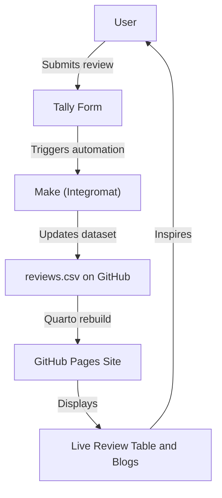

# 🌿 Conscious_Consumer  
### Sydney Eco Product Reviews  

A lightweight, community-powered platform to explore **authentic reviews** and **detailed blogs** on eco-friendly products available in Sydney.  
Built with **Quarto**, **GitHub Pages**, and **Tally forms**, this project helps conscious consumers make smarter everyday choices — from reusable straws to ethical cleaning products.  

---

## ♻️ Overview  

Reviews go from Tally → GitHub Action
Data syncs to reviews.csv in this repo
The site (hosted via GitHub Pages) updates the public review table automatically
Detailed product blogs live in /blog/ and are written in HTML or Markdown
**Conscious_Consumer** connects Sydney shoppers with real, community-sourced feedback on sustainable products.  
It’s simple, transparent, and open — designed to make sustainability easy, local, and trustworthy.  

---

## 🌱 What You Can Do  

- 📝 **Submit Reviews** — Share quick, 1–2 minute product reviews via a public [Tally form](#).  
- 📊 **View Ratings** — Browse a live, sortable table of community feedback.  
- 📚 **Read Blogs** — Dive into longer product insights, sustainability comparisons, and eco living tips.  

---

## 🔧 How It Works  

1. Reviews submitted through **Tally** are synced automatically via **Make (Integromat)**.  
2. Data updates the central **`reviews.csv`** file in this repository.  
3. The **Quarto site** (hosted via GitHub Pages) rebuilds automatically with the latest reviews.  
4. Blog posts in `/blog/` are written in Markdown or HTML and rendered as part of the site.  

---

## 🧭 User Flow Diagram  



```text
📂 Project Structure

📦 eco-review-site/
├─ _quarto.yml               ← Site config (title, nav, theme)
├─ index.qmd                 ← Home: product review table
├─ reviews.csv               ← Data pulled from Tally/Notion
├─ blog/
│   ├─ bamboo-toothbrush.qmd ← Individual blog posts
│   ├─ keepcup-review.qmd
├─ styles.css                ← Optional custom styles
```
 Built using Quarto, GitHub Pages, and Tally forms, this platform helps conscious consumers make better everyday choices — from reusable straws to ethical cleaning products.

✨ Features
📝 Submit 2-minute reviews via a simple public form
📊 View sortable, filterable review tables powered by CSV/JSON
📚 Read in-depth product blogs on sustainability, quality, and value
🔗 Open-source and free to contribute to or reuse
Whether you're just starting your eco journey or want to recommend a great bamboo toothbrush, your voice matters.

💡 Why It Exists
Sydney shoppers deserve simple, honest info about eco products. This site helps surface trustworthy feedback from real people — not ads.

## Review Schema

`reviews.csv` powers the table on the homepage and is expected to keep the following column order:

| Column      | Description                                           |
|-------------|-------------------------------------------------------|
| `Product`   | Name of the product being reviewed                     |
| `Brand`     | Brand or manufacturer                                  |
| `Rating`    | Numeric score (1–5)                                    |
| `Comment`   | Short free-form impression                             |
| `Category`  | Product category used for filtering                    |
| `Recommended` | Community recommendation (`Yes`/`No`/`Maybe`)        |
| `Code`      | Postcode or location code for context                  |

Use the existing sample rows as a template if you're adding entries manually.

## Automated Review Sync

Form responses from [Tally](https://tally.so/r/wdRZZq) are synced automatically with a scheduled GitHub Action defined in `.github/workflows/sync-tally.yml`.

### Secrets

Add the following repository secrets so the workflow can access the Tally API:

- `TALLY_API_KEY`: A Tally personal API key.
- `TALLY_FORM_ID`: The internal ID of the review form (visible in the Tally dashboard).

### How the Sync Works

1. The action runs every six hours (and can be triggered manually).
2. `scripts/sync_tally_reviews.py` downloads responses from the Tally API.
3. Answers are mapped onto the CSV headers listed above. Minor wording changes (for example `Product name` instead of `Product`) are handled by built-in aliases.
4. The script appends only responses submitted after the `last_submission` recorded in `.github/tally_state.json`, preventing duplicate rows.
5. The updated CSV and state file are committed back to the repository automatically.

### Running Locally

```bash
export TALLY_API_KEY="your_api_key"
export TALLY_FORM_ID="your_form_id"
python scripts/sync_tally_reviews.py --csv-path reviews.csv --state-file .github/tally_state.json
```

For local testing without hitting the API you can pass `--responses-file tests/data/sample_tally_responses.json --dry-run` to preview the mapped rows.

### Adding New Fields

If the Tally form is updated with new questions:

1. Update `LABEL_ALIASES` in `scripts/sync_tally_reviews.py` so the new field maps to the correct CSV column.
2. If a brand new column is needed, add it to `reviews.csv`, update `CSV_HEADERS` in the script, and adjust the Quarto template that consumes the CSV.
reviews.csv columns:
product | rating | review | date
