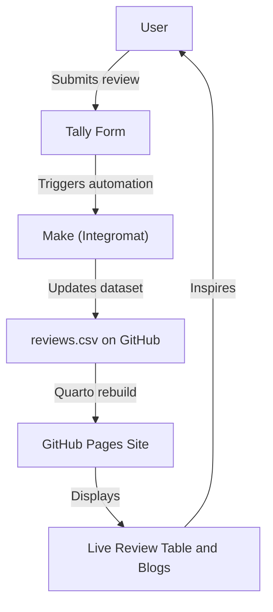

# 🌿 Conscious_Consumer  
### Sydney Eco Product Reviews  

A lightweight, community-powered platform to explore **authentic reviews** and **detailed blogs** on eco-friendly products available in Sydney.  
Built with **Quarto**, **GitHub Pages**, and **Tally forms**, this project helps conscious consumers make smarter everyday choices — from reusable straws to ethical cleaning products.  

---

## ♻️ Overview  

**Conscious_Consumer** connects Sydney shoppers with real, community-sourced feedback on sustainable products.  
It’s simple, transparent, and open — designed to make sustainability easy, local, and trustworthy.  

---

## 🌱 What You Can Do  

- 📝 **Submit Reviews** — Share quick, 1–2 minute product reviews via a public [Tally form](#).  
- 📊 **View Ratings** — Browse a live, sortable table of community feedback.  
- 📚 **Read Blogs** — Dive into longer product insights, sustainability comparisons, and eco living tips.  

---

## 🔧 How It Works  

1. Reviews submitted through **Tally** are synced automatically via **Make (Integromat)**.  
2. Data updates the central **`reviews.csv`** file in this repository.  
3. The **Quarto site** (hosted via GitHub Pages) rebuilds automatically with the latest reviews.  
4. Blog posts in `/blog/` are written in Markdown or HTML and rendered as part of the site.  

---

## 🧭 User Flow Diagram  



```text
📂 Project Structure

📦 eco-review-site/
├─ _quarto.yml               ← Site config (title, nav, theme)
├─ index.qmd                 ← Home: product review table
├─ reviews.csv               ← Data pulled from Tally/Notion
├─ blog/
│   ├─ bamboo-toothbrush.qmd ← Individual blog posts
│   ├─ keepcup-review.qmd
├─ styles.css                ← Optional custom styles
```
 Built using Quarto, GitHub Pages, and Tally forms, this platform helps conscious consumers make better everyday choices — from reusable straws to ethical cleaning products.

✨ Features
📝 Submit 2-minute reviews via a simple public form
📊 View sortable, filterable review tables powered by CSV/JSON
📚 Read in-depth product blogs on sustainability, quality, and value
🔗 Open-source and free to contribute to or reuse
Whether you're just starting your eco journey or want to recommend a great bamboo toothbrush, your voice matters.

💡 Why It Exists
Sydney shoppers deserve simple, honest info about eco products. This site helps surface trustworthy feedback from real people — not ads.

reviews.csv columns:
product | rating | review | date
